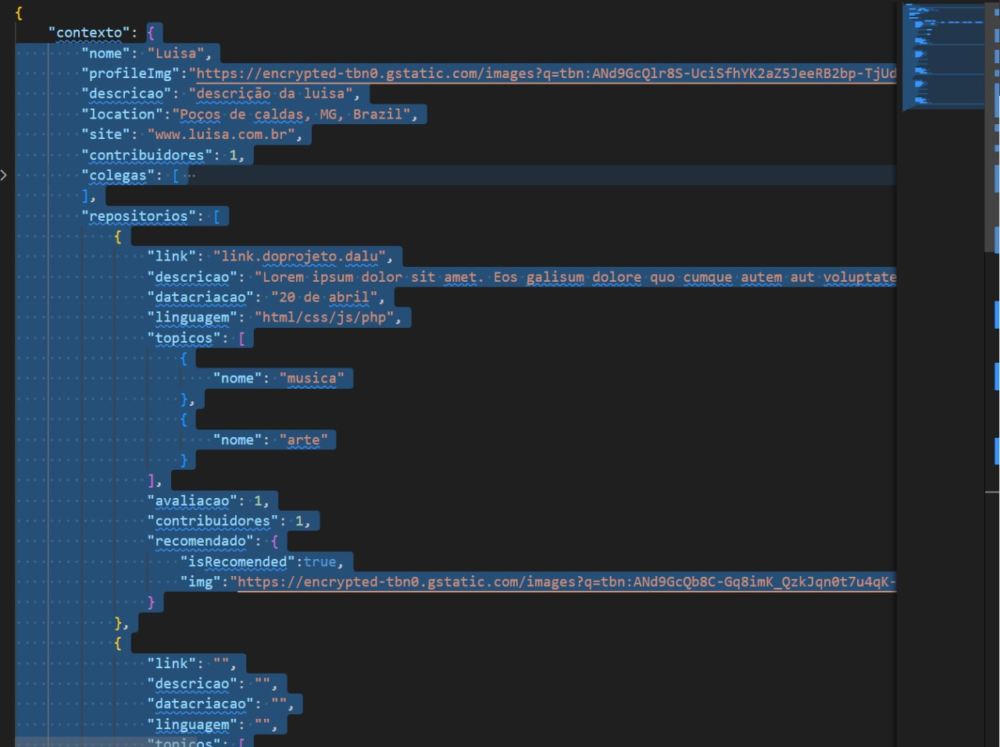
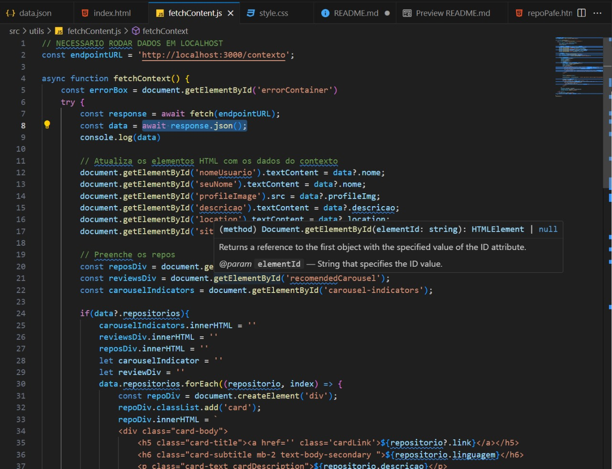
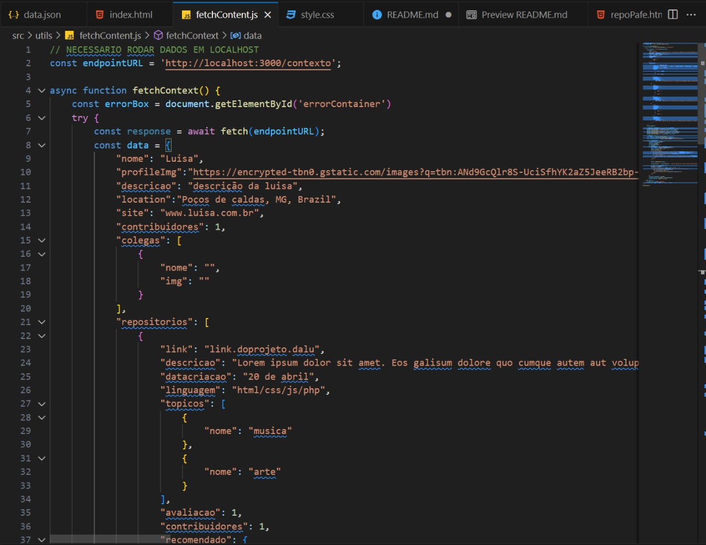

# Projeto da Luisa

### Essa pagina conta com dados em contexto para funcionar, por favor, siga o passo a passo para garantir o correto funcionamento da pagina

## Como rodar os dados em localhost 

- Instale npm and nodejs [aqui](https://docs.npmjs.com/downloading-and-installing-node-js-and-npm) esta a documentação

- rode 'npm install -g json-server' no seu terminal para instalar  json server globalmente

- rode 'json-server --watch data.json' para rodar os dados na em localhost na pagina 3000

- Agora só abrir 'index.html' para ver o site

## Caso não seja possivel efetuar algum destes passos siga:

-copie todo o conteudo de contexto do 'data/data.json'

-cole ele como valor de data em 'src/utils/fetchContent'

____________________________________________________

